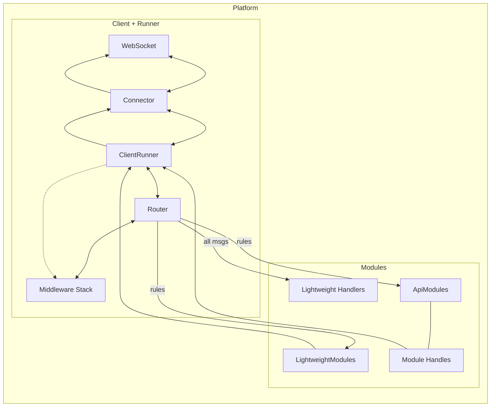
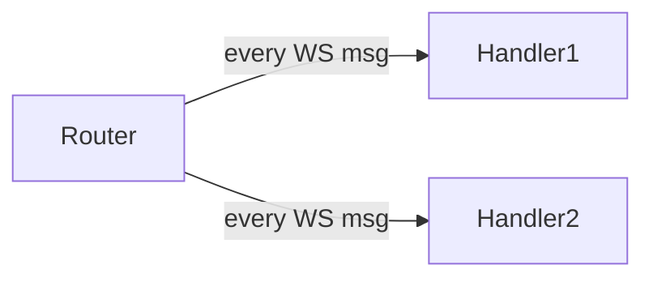
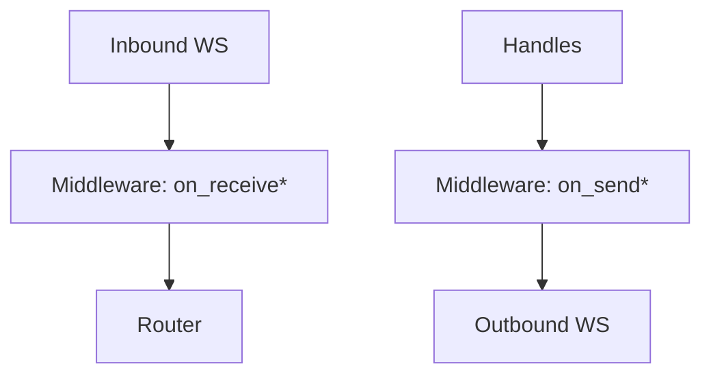
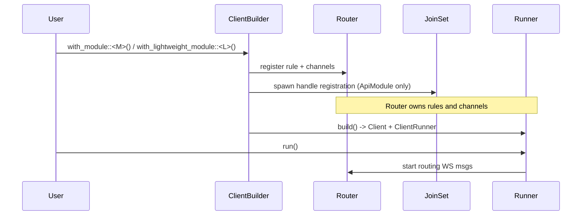
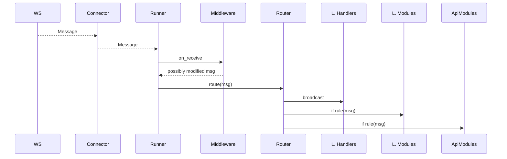
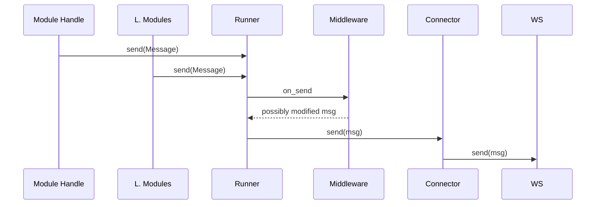
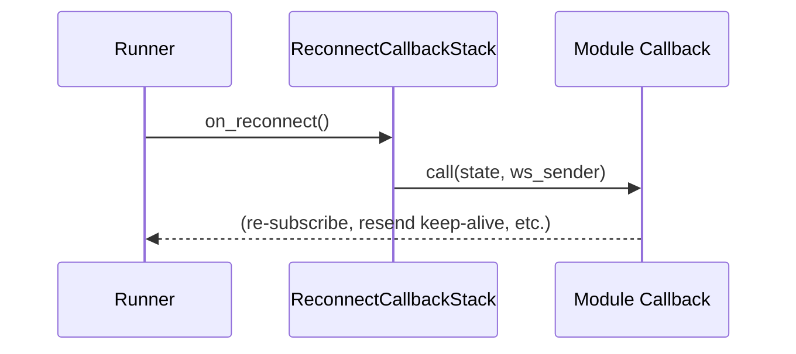

# System Architecture: Data Flow and Components

This document shows how data moves through the system: Client, Runner, Router, Middleware, ApiModules, LightweightModules, Lightweight Handlers, and Handles.

- Keep it simple: a few diagrams cover the full picture.
- Applies to all modules (Subscriptions, Trades, Raw, etc.).

## Legend

- WS: WebSocket connection managed by the Runner via the Connector
- Router: multiplexes messages to modules and handlers using rules
- Middleware: pre-/post-processing for inbound/outbound WS messages
- ApiModule: full-featured module with commands, responses, and a Handle
- LightweightModule: background task, receives routed WS messages, no command/response
- Lightweight Handler: global stateless callback receiving every WS message

## End-to-end Overview



- Inbound: WS -> Connector -> Runner -> Middleware (inbound) -> Router -> {LWH, LWM, AM} via rules.
- Outbound: {ApiModule via Handle, LightweightModule} -> Runner -> Middleware (outbound) -> Connector -> WS.

## ApiModule internals: commands, responses, and routing

```mermaid
flowchart LR
    subgraph Client
      Handle[Module Handle]
      Router
      subgraph Module[ApiModule<M>]
        direction TB
        RunLoop[run()]
        CmdRx[(CommandReceiver)]
        CmdTx[(CommandResponder)]
        MsgRx[(WS Msg Receiver)]
      end
    end

    %% User -> Module
    UserCode -->|send Command| Handle --> CmdRx
    RunLoop --> CmdTx -->|CommandResponse| Handle --> UserCode

    %% Routing of WS messages into module
    Router -- rule(M::rule)|--> MsgRx --> RunLoop
```

- The builder registers an M::Handle in a shared map. Client.get_handle::<M>() returns it.
- The module runs its own loop, reading commands and WS messages, emitting responses.

## LightweightModule internals: simple routed loop

```mermaid
flowchart LR
    Router -- rule(LightweightModule::rule) --> MsgRx[(WS Msg Receiver)] --> RunLoop[run()]
```

- No Handle or command/response. Great for keep-alive, monitoring, or augmenting state.

## Lightweight Handlers: global tap



- Registered callbacks executed for all messages (e.g., logging).

## Middleware positioning



- Middleware can inspect/modify inbound and outbound traffic globally.

## ClientBuilder, Runner, and module registration (sequence)



## Inbound message flow (detailed)



## Outbound message flow (detailed)



## Reconnect flow (high level)



## Where to look in the code

- Core: crates/core-pre/src
  - builder.rs: ClientBuilder (module registration, routing rules)
  - client.rs, connector.rs, router inside builder.rs
  - traits.rs: ApiModule, LightweightModule, AppState, Rule, ReconnectCallback
  - middleware.rs: Middleware stack
- PocketOption integration: crates/binary_options_tools/src/pocketoption
  - modules/\*: concrete modules (subscriptions, trades, server_time, raw, ...)
  - pocket_client.rs: registers modules and exposes get_handle helpers
