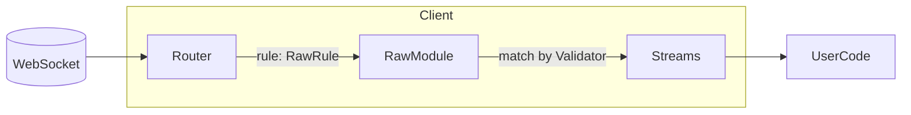
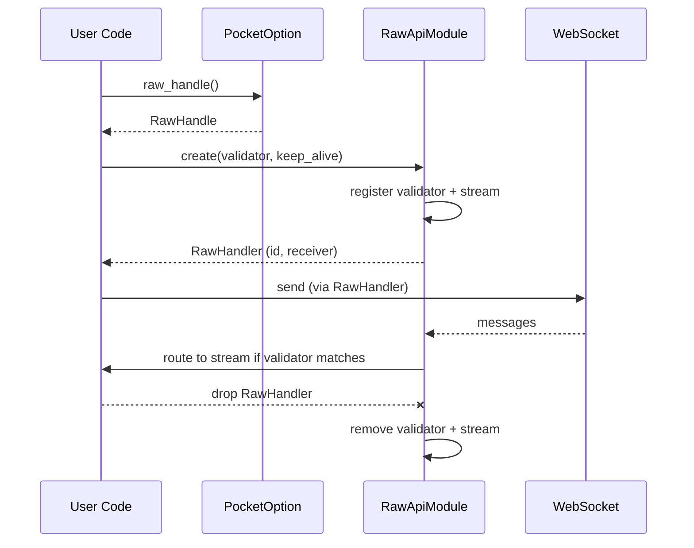

# Raw Module Architecture and Usage

This document explains the design of the Raw module: a flexible, validator-driven pipeline that lets you build features not covered by the built-in API (e.g., custom signals) while reusing the WebSocket connection, reconnection, and keep-alive logic.

## Overview

- Platform (PocketOption client) -> Create handler for a specific validator -> Handler interacts with Raw module to send/receive.
- You define a `Validator` that decides which incoming WS messages you care about.
- The Raw module routes matching messages into a per-validator stream.
- Handlers can send text/binary messages and optionally define a keep-alive message resent on reconnect.
- Dropping a handler removes its validator and stream automatically.

## Components

- Validator: enum + trait; runs on `&str` built from WS message content.
- RawApiModule: ApiModule that maintains a map of validators and their streams.
- RawHandle: top-level handle obtained from `PocketOption` to create/remove handlers.
- RawHandler: per-validator handle to send/receive and subscribe to matching messages.

## Message Flow



- Router forwards only messages for which at least one registered validator returns true.
- RawModule fans out each message to all matching validator streams.

## Lifecycle



## API Sketch

- PocketOption
  - raw_handle() -> RawHandle
  - create_raw_handler(validator, keep_alive) -> RawHandler
- RawHandle
  - create(validator, keep_alive) -> RawHandler
  - remove(id) -> bool
- RawHandler
  - id() -> Uuid
  - send_text(text)
  - send_binary(bytes)
  - send_and_wait(msg) -> next matching Message
  - wait_next() -> next matching Message
  - subscribe() -> AsyncReceiver<Message>
  - Drop: auto-remove validator and stream

## Keep-Alive on Reconnect

If a handler is created with a `keep_alive` message, the module will re-send it after reconnects so servers maintain your subscription.

## Notes

- Validators are stored by UUID; you can remove them explicitly or by dropping their handler.
- Incoming messages are transformed to String for validation; original Message (text/binary) is delivered to the stream.
- The module is best-effort for fan-out; if a user stream is closed, the send is ignored.

## Example

```rust
use binary_options_tools_pocketoption::{PocketOption};
use binary_options_tools_pocketoption::validator::Validator;
use binary_options_tools_pocketoption::pocketoption::modules::raw::Outgoing;

async fn demo(ssid: &str) -> anyhow::Result<()> {
let api = PocketOption::new(ssid).await?;
let validator = Validator::contains("updateStream".to_string());
let handler = api
    .create_raw_handler(validator, Some(Outgoing::Text("42[\"ping\"]".into())))
    .await?;

handler.send_text("42[\"hello\"]").await?;
let msg = handler.wait_next().await?; // next matching Message
println!("got: {:?}", msg);
Ok(())
}
```
